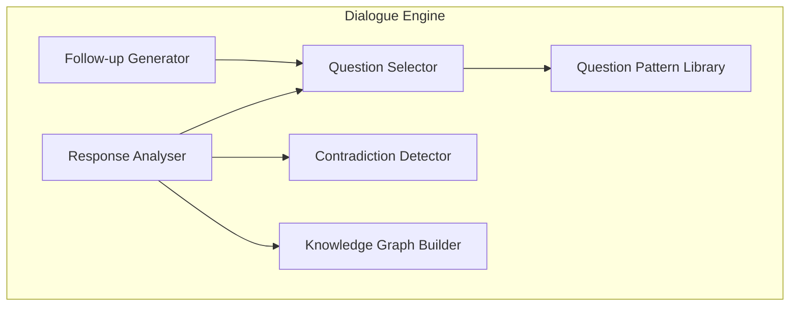
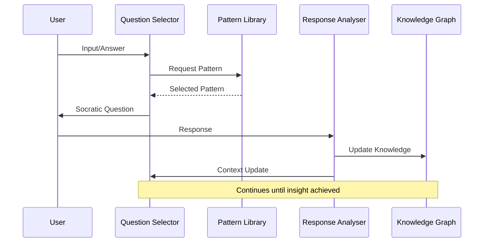

# Dialogue Engine Architecture

## Overview

The Dialogue Engine is the core component of the Dialogue MCP Server, responsible for generating Socratic questions, analyzing responses, and managing the flow of dialogue sessions.

## Component Architecture

## Core Components

### Question Pattern Library
- Stores 13 distinct Socratic question patterns
- Each pattern includes:
  - Pattern type and template
  - Context triggers
  - Follow-up strategies
  - Example responses

### Question Selector
- Context-aware selection algorithm
- Considers:
  - Current conversation state
  - User expertise level
  - Project phase
  - Previous responses
- Implements adaptive intelligence for depth adjustment

### Response Analyser
- Parses user responses for key insights
- Extracts:
  - Assumptions (implicit and explicit)
  - Definitions
  - Requirements
  - Constraints
  - Contradictions
- Updates session context with findings

### Follow-up Generator
- Creates contextual follow-up questions
- Implements depth control
- Manages question chains ("Why?" sequences)
- Prevents circular questioning

### Contradiction Detector
- Identifies logical inconsistencies
- Tracks decision conflicts
- Alerts to assumption violations
- Maintains contradiction history

### Knowledge Graph Builder
- Constructs relationships between concepts
- Tracks:
  - Assumption dependencies
  - Requirement chains
  - Decision rationale
  - Constraint impacts
- Persists knowledge across sessions

## Data Flow

## Integration Points

- **Session Manager**: Maintains dialogue state
- **MCP Server**: Exposes tools and resources
- **Storage Layer**: Persists knowledge graphs
- **Template Engine**: Renders dynamic content

## Performance Considerations

- Question selection: O(n) where n = number of patterns
- Knowledge graph updates: O(log n) using adjacency lists
- Response time target: <200ms per interaction
- Memory usage: Scales with session history length

## Extensibility

The engine supports:
- Custom question patterns via configuration
- Pluggable analysis modules
- External knowledge sources
- Domain-specific ontologies