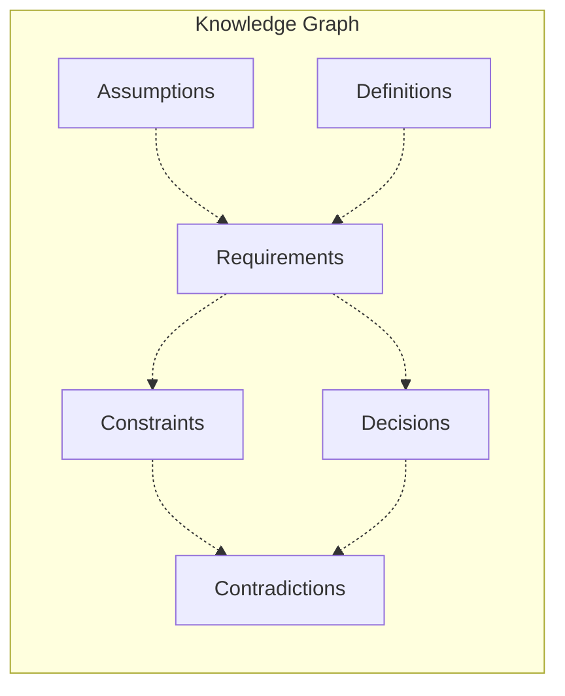

# Knowledge Management Architecture

## Overview

The Knowledge Management system tracks discoveries, relationships, and contradictions throughout Socratic dialogue sessions, building a persistent knowledge graph.

## Knowledge Graph Structure



## Data Model

### Node Types

#### Assumptions
```typescript
interface Assumption {
  id: string;
  type: 'implicit' | 'explicit';
  statement: string;
  source: QuestionReference;
  confidence: number;
  dependencies: string[];
}
```

#### Definitions
```typescript
interface Definition {
  id: string;
  term: string;
  meaning: string;
  context: string;
  source: QuestionReference;
  alternatives: string[];
}
```

#### Requirements
```typescript
interface Requirement {
  id: string;
  statement: string;
  type: 'functional' | 'non-functional';
  priority: 'must' | 'should' | 'could';
  assumptions: string[];
  measurable: boolean;
}
```

#### Decisions
```typescript
interface Decision {
  id: string;
  statement: string;
  status: 'to-be-made' | 'provisional' | 'firm' | 'superseded';
  rationale: string;
  alternatives: Alternative[];
  dependencies: string[];
  timestamp: Date;
}
```

#### Contradictions
```typescript
interface Contradiction {
  id: string;
  elements: string[]; // IDs of conflicting nodes
  type: 'logical' | 'temporal' | 'priority';
  description: string;
  resolved: boolean;
  resolution?: string;
}
```

## Storage Architecture

### Current Implementation (Phase 1)
- JSON-based persistence
- File structure:
  ```
  sessions/
  ├── {session-id}/
  │   ├── dialogue.json
  │   ├── knowledge-graph.json
  │   └── insights.json
  ```

### Future Implementation (Phase 2)
- SQLite database with schema:
  ```sql
  CREATE TABLE nodes (
    id TEXT PRIMARY KEY,
    type TEXT NOT NULL,
    data JSON NOT NULL,
    session_id TEXT NOT NULL,
    created_at TIMESTAMP DEFAULT CURRENT_TIMESTAMP
  );
  
  CREATE TABLE edges (
    from_id TEXT NOT NULL,
    to_id TEXT NOT NULL,
    relationship TEXT NOT NULL,
    properties JSON,
    PRIMARY KEY (from_id, to_id, relationship)
  );
  ```

## Graph Operations

### Core Algorithms

#### Contradiction Detection
```typescript
function detectContradictions(graph: KnowledgeGraph): Contradiction[] {
  // 1. Check logical contradictions (A and NOT A)
  // 2. Check temporal contradictions (conflicting timelines)
  // 3. Check priority contradictions (mutual exclusions)
  // 4. Check dependency cycles
}
```

#### Impact Analysis
```typescript
function analyzeImpact(nodeId: string, graph: KnowledgeGraph): Impact {
  // 1. Traverse dependent nodes
  // 2. Calculate cascade effects
  // 3. Identify affected requirements
  // 4. Return impact severity and scope
}
```

#### Path Finding
```typescript
function findPath(from: string, to: string, graph: KnowledgeGraph): Path {
  // Implements Dijkstra's algorithm
  // Returns shortest conceptual path
  // Used for relationship discovery
}
```

## Query Interface

### Graph Queries
- Find all assumptions for a requirement
- List unresolved contradictions
- Show decision dependencies
- Trace assumption origins
- Calculate decision impact

### Insight Generation
- Pattern recognition across sessions
- Common assumption identification
- Contradiction clustering
- Decision pattern analysis

## Performance Characteristics

- Node insertion: O(1)
- Edge creation: O(1)
- Contradiction detection: O(n²) worst case
- Path finding: O(n log n) with optimization
- Graph serialization: O(n + e)

## Integration Points

- **Dialogue Engine**: Updates graph during response analysis
- **MCP Tools**: Exposes query interface
- **Visualization**: D3.js rendering of relationships
- **Export**: GraphML, JSON, Mermaid formats

## Future Enhancements

### Phase 2: Decision Tracking
- Decision status state machine
- Version control for decisions
- Audit trail maintenance

### Phase 3: Advanced Analytics
- Machine learning on patterns
- Predictive contradiction detection
- Automated insight generation
- Cross-project knowledge transfer