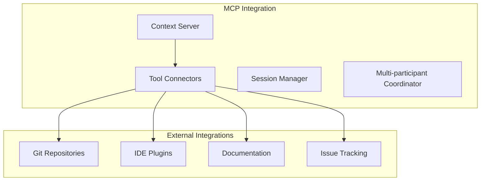

# MCP Integration Architecture

## Overview

The MCP (Model Context Protocol) integration layer enables the Dialogue MCP Server to expose its functionality to LLM clients through standardized tools and resources.

## Architecture Overview



## Core Components

### MCP Server Implementation
- Built on the official MCP SDK
- Implements streamable HTTP transport
- Provides JSON-RPC 2.0 interface
- Handles concurrent client connections

### Tools Exposed

#### 1. start_dialogue
- Initiates a new Socratic dialogue session
- Parameters:
  - topic: Subject for exploration
  - context: Optional project context
  - expertise_level: User's domain knowledge
- Returns: Session ID and initial question

#### 2. respond
- Submits an answer to the current question
- Parameters:
  - session_id: Active session identifier
  - response: User's answer
- Returns: Analysis results and follow-up question

#### 3. get_insights
- Retrieves discovered insights from session
- Parameters:
  - session_id: Session to analyze
  - type: Optional filter (assumptions, requirements, etc.)
- Returns: Structured insights with relationships

#### 4. decision_tracking (Phase 2)
- CRUD operations for decision management
- Tracks decision status transitions
- Maintains decision relationships

### Resources Provided

#### 1. Question Patterns
- URI: `dialogue://patterns/{pattern_type}`
- Dynamic content based on:
  - User expertise level
  - Current project phase
  - Session context
- Rendered using template system

#### 2. Session History
- URI: `dialogue://sessions/{session_id}`
- Complete dialogue transcript
- Discovered insights
- Knowledge graph state

#### 3. Knowledge Graph
- URI: `dialogue://knowledge/{session_id}`
- Visual representation of discoveries
- Relationship mappings
- Contradiction highlights

## Integration Architecture

### Transport Layer
```typescript
interface DialogueTransport {
  protocol: 'http';
  baseUrl: string;
  authentication?: {
    type: 'bearer' | 'basic';
    credentials: string;
  };
}
```

### Session Management
- Unique session IDs (UUID v4)
- Persistent storage (JSON/SQLite)
- Concurrent session support
- Session timeout handling (configurable)

### Configuration
- Environment-based settings
- Supports:
  - Custom prompts directory
  - External template paths
  - Logging levels
  - Session persistence options

## External Integrations

### Current Capabilities
- File system access for templates
- JSON-based session storage
- Structured logging with Pino

### Future Integrations (Phase 3)
- Git repository analysis
- IDE plugin support
- Documentation parsing
- Issue tracking integration

## Security Considerations

- Input validation on all tool parameters
- Session isolation between users
- Rate limiting for tool calls
- Sanitized error messages
- No execution of user-provided code

## Performance Metrics

- Tool response time: <200ms target
- Concurrent sessions: 100+ supported
- Memory per session: ~10MB average
- Storage per session: ~100KB JSON