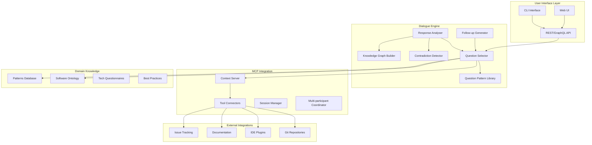
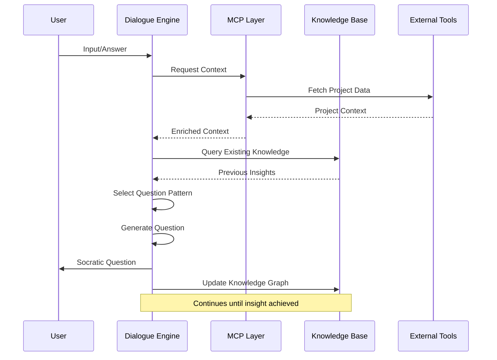
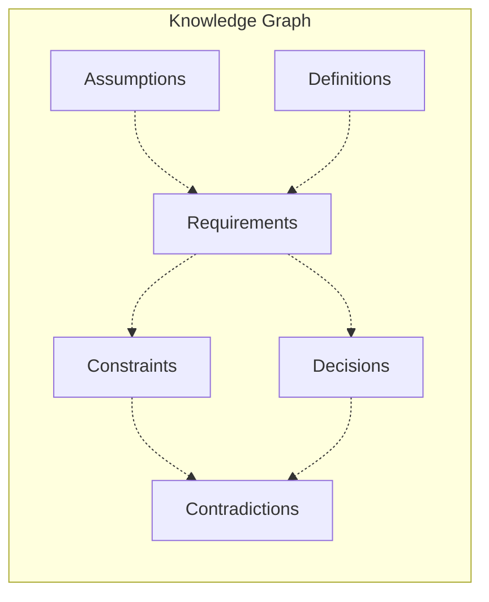
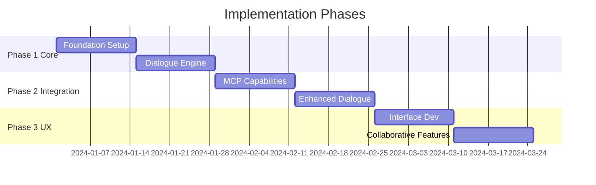
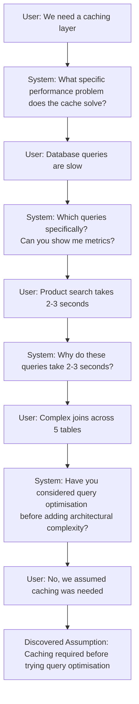

# Socratic Development Dialogue Service: Design & Implementation Plan

## Overview

A dialogue service using MCP capabilities to provide Socratic questioning for software development teams, helping refine design, planning, and implementation through systematic inquiry.

## High-Level Design

### System Architecture

### Data Flow

## Core Components

### 1. Dialogue Engine

**Question Pattern Library**
- Definition-Seeking ("What is X?")
- Assumption Excavation ("Why?" chains)
- Consistency Testing (Contradiction patterns)
- Concrete Instantiation (Example requests)
- Necessity Testing (Hypothetical removal)
- Conceptual Clarity (Analogy probes)
- Epistemic Humility (Knowledge boundaries)
- Solution Space Mapping (Alternative exploration)
- Impact Analysis (Consequence traces)
- Value Clarification (Priority revelation)

**Adaptive Intelligence**
- Context-aware question selection
- Expertise-based depth adjustment
- Project phase appropriate questioning
- Learning from previous responses

### 2. MCP Integration Layer

**Capabilities**
- Project file system access
- Development tool integration
- Real-time code analysis
- Documentation parsing
- Multi-user session coordination

### 3. Knowledge Management

## Functionality Briefing

### Primary Dialogue Modes

#### 1. Project Inception Dialogue
- **Purpose**: Clarify project vision and uncover hidden assumptions
- **Patterns Used**: Definition-seeking, assumption excavation
- **Output**: Refined project charter with explicit assumptions

#### 2. Architecture Review
- **Purpose**: Validate design decisions and explore alternatives
- **Patterns Used**: "Why?" chains, alternative exploration
- **Output**: Architectural decision records with rationale

#### 3. Requirements Refinement
- **Purpose**: Transform vague requirements into measurable criteria
- **Patterns Used**: Concrete instantiation, contradiction detection
- **Output**: Precise acceptance criteria and priority matrix

#### 4. Implementation Planning
- **Purpose**: Expose planning gaps and validate estimates
- **Patterns Used**: Hypothetical scenarios, consequence tracing
- **Output**: Risk-aware implementation roadmap

#### 5. Code Review Dialogue
- **Purpose**: Question design choices and complexity
- **Patterns Used**: Necessity testing, pattern analysis
- **Output**: Refactoring insights and improvements

### Key Features

**Adaptive Questioning**
- Adjusts to participant expertise level
- Learns project-specific terminology
- Balances breadth vs depth

**Knowledge Persistence**
- Maintains discoveries across sessions
- Builds project wisdom base
- Prevents circular discussions

**Collaborative Mode**
- Facilitates team dialogues
- Manages conflicting viewpoints
- Synthesises group insights

## Implementation Plan

### Development Timeline

### Phase 1: Core Prototype (Weeks 1-4)

**Foundation (Weeks 1-2)**
- Set up MCP server framework
- Implement basic question patterns
- Create context management
- Build CLI interface

**Dialogue Engine (Weeks 3-4)**
- Question selection logic
- Response parsing
- Knowledge graph structure
- Session persistence

**Deliverable**: CLI tool for basic Socratic dialogue

### Phase 2: Integration & Intelligence (Weeks 5-8)

**MCP Capabilities (Weeks 5-6)**
- File system access
- Repository integration
- Context analyser
- Domain knowledge module

**Enhanced Dialogue (Weeks 7-8)**
- Expanded pattern library
- Contradiction detection
- Adaptive questioning
- Insight synthesis

**Deliverable**: Integrated service with project artefact engagement

### Phase 3: User Experience (Weeks 9-12)

**Interface Development (Weeks 9-10)**
- Web-based conversational UI
- Visual knowledge mapping
- Session management
- Export functionality

**Collaborative Features (Weeks 11-12)**
- Multi-participant support
- Role-based questioning
- Team insight synthesis
- Tool integrations

**Deliverable**: Full prototype with polished UI

## Technical Stack

### Core Implementation
- **Language**: Python or TypeScript
- **MCP Framework**: Official MCP SDK
- **Knowledge Graph**: Neo4j or in-memory graph
- **NLP**: spaCy for response analysis

### Interface
- **Frontend**: React with conversational UI
- **Visualisation**: D3.js for knowledge maps
- **API**: REST or GraphQL

### Integrations
- Git libraries for repository access
- Markdown parsers for documentation
- JSON Schema for requirement validation

## Success Metrics

1. **Depth of Inquiry**: Average questions to reach foundational assumptions
2. **Insight Quality**: Participant ratings of discovered insights
3. **Assumption Discovery**: Count of implicit assumptions made explicit
4. **Requirement Clarity**: Measurable improvement in precision
5. **Time Efficiency**: Reduction in planning/review time

## Risk Mitigation

| Risk | Mitigation Strategy |
|------|-------------------|
| Over-questioning | Implement depth limits and time-boxing |
| Context Loss | Robust session state management |
| User Frustration | Clear progress indicators and value demos |
| Integration Complexity | Start minimal, expand gradually |

## Example Dialogue Flow

## Next Steps

1. **Prototype Development**: Begin with Phase 1 core implementation
2. **User Testing**: Recruit 3-5 development teams for early feedback
3. **Pattern Refinement**: Iterate on question patterns based on real usage
4. **Integration Expansion**: Prioritise tool integrations based on user needs
5. **Scale Testing**: Evaluate performance with larger knowledge graphs