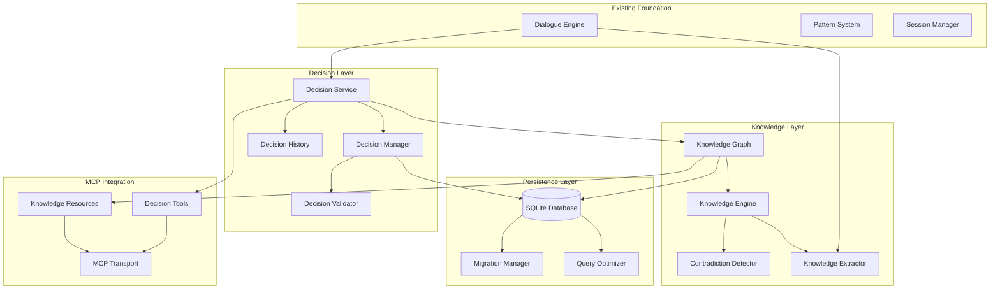
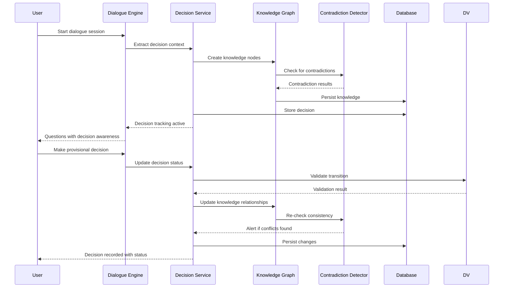
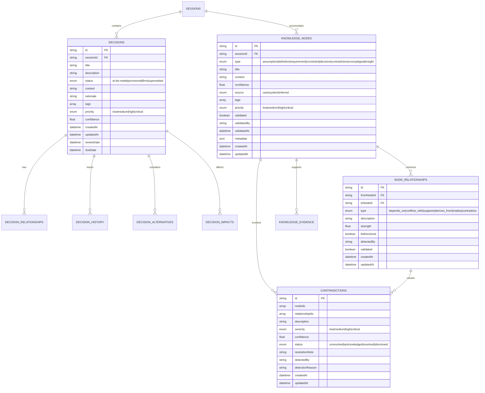

# Phase 2 Implementation Plan: Decision Tracking & Knowledge Management

**Date**: July 13, 2025  
**Version**: v2  
**Topic**: Decision Tracking & Knowledge Management  
**Timeline**: Q3 2025 (Weeks 13-20)  
**Target Version**: v0.2.0  

## Project Overview

Building comprehensive decision tracking and knowledge management capabilities on top of the existing Socratic dialogue foundation. This phase transforms the system from a conversational tool into an intelligent decision support system with knowledge persistence and contradiction detection.

## Technical Architecture

### System Design



### Data Flow Architecture



### Database Schema



## Implementation Components

### 1. Decision Service (`src/decisions/`)

#### Core Files Structure
```
src/decisions/
├── DecisionService.ts        # Main service orchestrator
├── DecisionManager.ts        # CRUD operations and lifecycle
├── DecisionValidator.ts      # Status transition validation
├── DecisionHistory.ts        # Change tracking and audit
├── DecisionQuery.ts          # Advanced search and filtering
└── __tests__/
    ├── DecisionService.test.ts
    ├── DecisionManager.test.ts
    ├── DecisionValidator.test.ts
    └── integration/
        └── DecisionFlow.test.ts
```

#### Key Responsibilities

**DecisionService.ts**
- Primary interface for decision operations
- Coordinates between manager, validator, and knowledge graph
- Handles business logic and orchestration
- Integrates with session management

**DecisionManager.ts**
- CRUD operations for decisions
- Status lifecycle management
- Alternative tracking
- Impact assessment
- Relationship management

**DecisionValidator.ts**
- Status transition validation rules
- Decision completeness validation
- Consistency checking with knowledge graph
- Business rule enforcement

### 2. Knowledge Graph Engine (`src/knowledge/`)

#### Core Files Structure
```
src/knowledge/
├── KnowledgeGraph.ts         # Graph data structure and operations
├── KnowledgeEngine.ts        # High-level graph intelligence
├── ContradictionDetector.ts  # Logic conflict detection
├── KnowledgeExtractor.ts     # Extract knowledge from dialogue
├── GraphTraversal.ts         # Path finding and analysis
├── ConsistencyRules.ts       # Rule engine for validation
└── __tests__/
    ├── KnowledgeGraph.test.ts
    ├── ContradictionDetector.test.ts
    └── integration/
        └── GraphAnalysis.test.ts
```

#### Key Algorithms

**Graph Implementation**
- Adjacency list representation for efficient traversal
- Weighted edges for relationship strength
- Bidirectional relationship support
- Efficient path finding (Dijkstra's algorithm)

**Contradiction Detection**
- Pattern-based conflict detection
- Logical inconsistency identification
- Temporal constraint validation
- Domain-specific rule checking

**Knowledge Extraction**
- Pattern matching for structured extraction
- Context-aware entity recognition
- Relationship inference from dialogue
- Confidence scoring for extracted knowledge

### 3. Database Migration (`src/persistence/`)

#### Migration Strategy
```
src/persistence/
├── DatabaseManager.ts        # Database connection and lifecycle
├── MigrationManager.ts       # Schema versioning and migration
├── QueryOptimizer.ts         # Performance optimization
├── migrations/
│   ├── 001_initial_schema.sql
│   ├── 002_decision_tables.sql
│   ├── 003_knowledge_graph.sql
│   └── 004_indexes_and_constraints.sql
└── __tests__/
    └── migration.test.ts
```

#### Migration Steps
1. **Schema Creation**: SQLite tables with proper indexes
2. **Data Migration**: JSON to SQLite with data validation
3. **Performance Optimization**: Query optimization and indexing
4. **Rollback Strategy**: Safe migration with rollback capability

### 4. MCP Integration Enhancement

#### New Tools
```typescript
// Decision management tools
- create_decision(title, description, context)
- update_decision_status(id, status, rationale)
- list_decisions(query_params)
- analyze_decision_impacts(id)
- detect_decision_conflicts()

// Knowledge graph tools  
- query_knowledge_graph(params)
- add_knowledge_relationship(from, to, type)
- validate_knowledge_consistency()
- export_knowledge_map(format)
```

#### New Resources
```typescript
// Dynamic knowledge resources
- knowledge://graph/overview
- knowledge://contradictions/active
- knowledge://decisions/pending
- knowledge://insights/session/{sessionId}
```

## Implementation Phases

### Week 13-14: Foundation Setup
**Deliverables**:
- SQLite database schema design and creation
- Basic decision service with CRUD operations  
- Knowledge graph data structure implementation
- Migration utilities for JSON to SQLite

**Acceptance Criteria**:
- [ ] SQLite schema created with all required tables
- [ ] Decision CRUD operations functional
- [ ] Basic knowledge graph operations (add/remove nodes and edges)
- [ ] JSON data successfully migrated to SQLite
- [ ] All unit tests passing for core components

### Week 15-16: Decision Lifecycle Management  
**Deliverables**:
- Complete decision status transition system
- Decision validation and business rules
- Decision history and audit trail
- Advanced decision querying and filtering

**Acceptance Criteria**:
- [ ] All decision status transitions properly validated
- [ ] Decision history tracked with complete audit trail
- [ ] Complex decision queries work (by status, date, tags, etc.)
- [ ] Business rule validation prevents invalid states
- [ ] Performance tests pass for 1000+ decisions

### Week 17-18: Knowledge Graph Intelligence
**Deliverables**:
- Knowledge extraction from dialogue
- Relationship inference and management
- Graph traversal and path analysis
- Contradiction detection algorithms

**Acceptance Criteria**:
- [ ] Knowledge automatically extracted from user responses
- [ ] Relationships correctly inferred and weighted
- [ ] Graph traversal algorithms work for complex paths
- [ ] Contradiction detection identifies logical conflicts
- [ ] Performance tests pass for graphs with 10,000+ nodes

### Week 19-20: Integration and Optimization
**Deliverables**:
- MCP tools for decision and knowledge operations
- Performance optimization and caching
- Comprehensive testing and validation
- Documentation and examples

**Acceptance Criteria**:
- [ ] All MCP tools functional and tested
- [ ] System performance meets requirements (<100ms graph queries)
- [ ] Integration tests pass for complete workflows
- [ ] Documentation complete with usage examples
- [ ] Memory usage optimized for long-running sessions

## Success Metrics

### Functional Metrics
1. **Decision Tracking Accuracy**: 100% of decision status transitions properly validated
2. **Knowledge Extraction Rate**: >80% of user statements result in knowledge nodes
3. **Contradiction Detection**: >90% accuracy on test contradiction scenarios
4. **Data Integrity**: Zero data loss during JSON to SQLite migration

### Performance Metrics
1. **Decision Query Time**: <50ms for complex decision searches
2. **Graph Traversal Time**: <100ms for paths up to 10 hops
3. **Contradiction Detection**: <200ms for full graph analysis
4. **Memory Usage**: <100MB for sessions with 1000+ decisions

### Quality Metrics
1. **Test Coverage**: >95% for all decision and knowledge modules
2. **API Reliability**: <0.1% error rate for MCP operations
3. **Data Consistency**: 100% referential integrity maintained
4. **Migration Success**: 100% data preservation during migration

## Risk Assessment and Mitigation

| Risk | Probability | Impact | Mitigation Strategy |
|------|-------------|--------|-------------------|
| **SQLite Performance Issues** | Medium | High | Implement query optimization, indexing strategy, and connection pooling |
| **Graph Algorithm Complexity** | Medium | Medium | Use proven algorithms, implement caching, progressive loading |
| **Migration Data Loss** | Low | Critical | Comprehensive backup strategy, rollback procedures, validation |
| **Memory Leaks in Graph** | Medium | Medium | Regular memory profiling, garbage collection optimization |
| **Contradiction Detection Accuracy** | High | Medium | Extensive test scenarios, user feedback loop, tunable thresholds |

## Testing Strategy

### Unit Testing
- **Decision Service**: All CRUD operations, status transitions, validation rules
- **Knowledge Graph**: Node/edge operations, traversal algorithms, consistency checks
- **Contradiction Detection**: Logic patterns, conflict scenarios, edge cases
- **Database Operations**: Schema validation, query performance, transaction integrity

### Integration Testing  
- **Complete Decision Workflow**: From dialogue to decision tracking to knowledge creation
- **Knowledge Graph Integration**: Dialogue → extraction → graph → contradiction detection
- **MCP Tool Integration**: External tool calls with realistic scenarios
- **Migration Testing**: JSON to SQLite with various data scenarios

### Performance Testing
- **Load Testing**: 1000+ concurrent decisions, 10,000+ knowledge nodes
- **Memory Profiling**: Long-running sessions, graph growth patterns
- **Query Performance**: Complex graph traversals, decision searches
- **Cache Effectiveness**: Hit rates, invalidation patterns

### User Acceptance Testing
- **Decision Tracking Workflow**: Real-world decision scenarios with multiple stakeholders
- **Knowledge Discovery**: Validate extracted knowledge matches user intent
- **Contradiction Scenarios**: Test with deliberately conflicting information
- **Migration Validation**: Verify all historical data correctly preserved

## Dependencies and Integration Points

### Internal Dependencies
- **Existing Dialogue Engine**: Decision extraction integration
- **Session Management**: Decision-session association  
- **Configuration System**: Database connection settings
- **Logging System**: Decision and knowledge change tracking

### External Dependencies
- **SQLite**: Database engine with JSON support
- **MCP SDK**: Tool and resource extensions
- **TypeScript**: Type safety for complex graph operations

### Migration Requirements
- **Backup Strategy**: Complete JSON data backup before migration
- **Rollback Plan**: Ability to revert to JSON storage if needed
- **Validation**: Comprehensive data integrity checks post-migration

## Next Steps

### Immediate Actions (Week 13)
1. **Database Schema Design**: Create SQLite schema with proper indexing
2. **Decision Service Skeleton**: Basic structure and interfaces
3. **Testing Framework**: Setup for decision and knowledge testing
4. **Development Environment**: SQLite integration and tooling

### Success Validation
1. **Week 14 Checkpoint**: Basic CRUD operations functional
2. **Week 16 Checkpoint**: Decision lifecycle management complete
3. **Week 18 Checkpoint**: Knowledge graph operations functional  
4. **Week 20 Final**: All acceptance criteria met, ready for production

---

**Plan Approval Required**: This plan requires stakeholder approval before implementation begins. Key decisions include SQLite as the database choice, graph algorithm approaches, and performance targets.